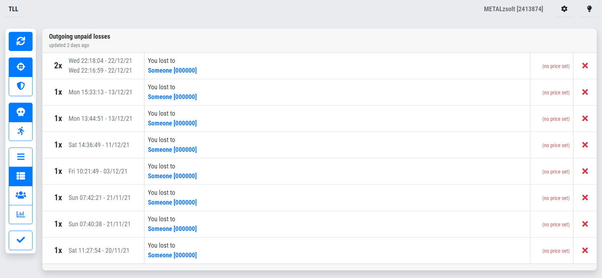
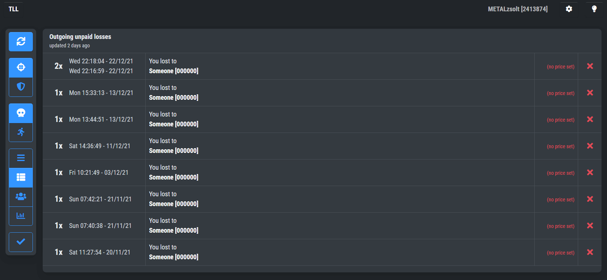
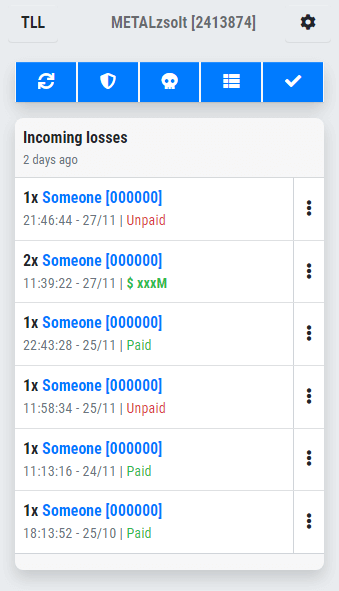
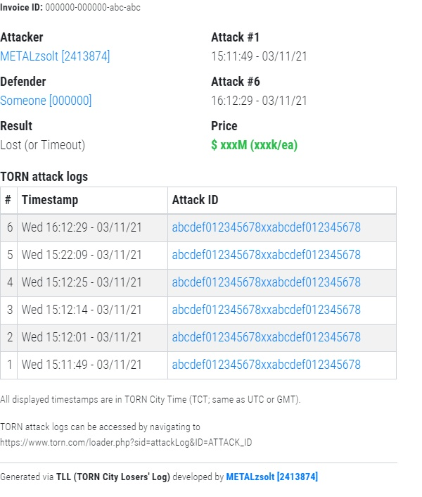
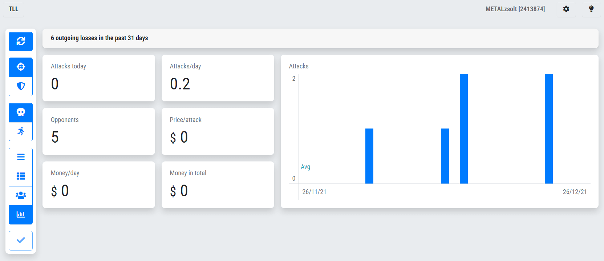

This tool is being developed for TORN City players. If you don't know what TORN City is and wanna try it out, **[register here](https://www.torn.com/2413874)** so we both can get benefits!

---

# TLL <small>(TORN City Losers' Log)</small>

**TLL** was originally designed only for loss sellers, but now (v2+) aims to help loss buying activity too, as it can:

- 🧾 📊 list, filter, group, count, plot,
- 🏷️ 💰 store price and paid status
- 💀 🏃 of losses **and escapes (NEW!)**
- 🎯 🛡️ you made **or received! (NEW!)**

It does all this entirely in your browser, which means your API key won't be sent out nor stored on a 3rd party server. (In fact, TLL doesn't have any server-side code or database, it's a static website.) However, this also means that you have to carry over your data manually, if you decide to switch browsers. **TLL** provides export and import mechanisms to help with that.


## Screenshots

Desktop:



Desktop, dark mode:



Mobile:



Invoice export:



Statistics screen:




## License

MIT, please see the `LICENSE` file!


## Developer notes

**TLL** is a Nuxt project with `static` target.

```
# Setup
yarn

# Start development server
yarn run serve

# Generate site to "dist/"
yarn run build

# Release (bump version & push)
yarn run release && git push --follow-tags origin main
```

Screens:


