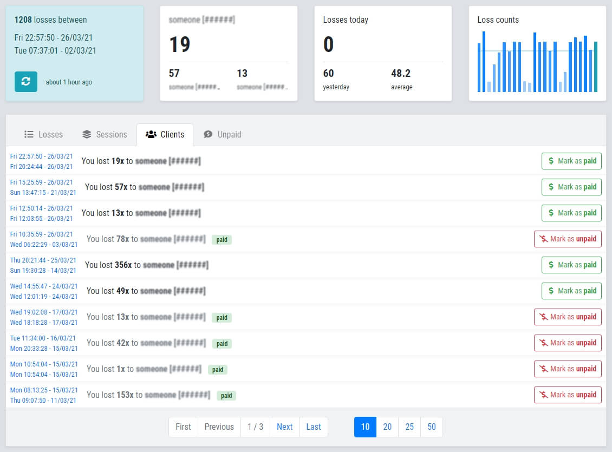
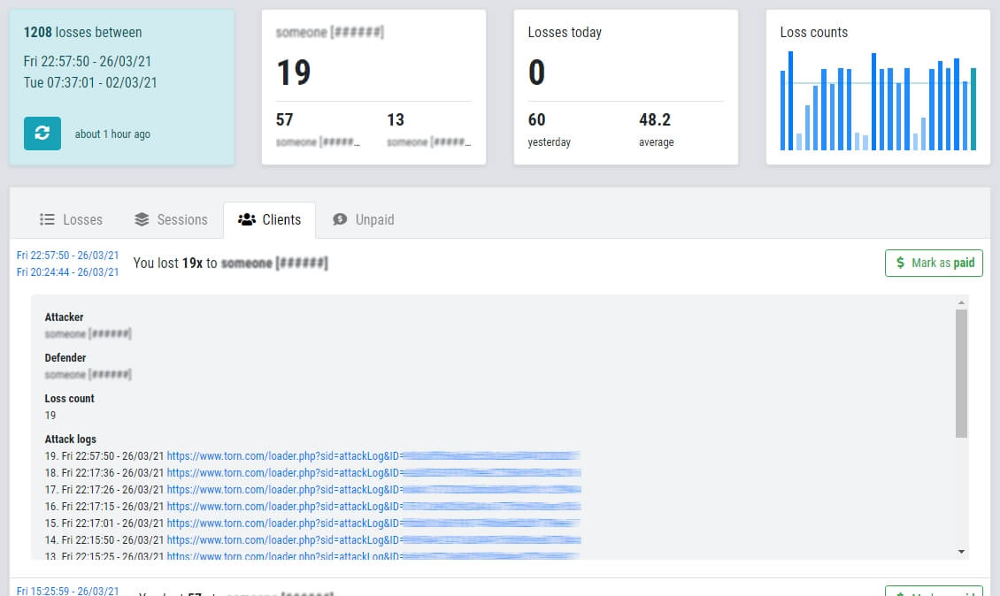

# About

**TORN City Losers' Log (TLL)** is a tool which **aims to help loss sellers** by providing them

- **automatic counting**
- **performance statistics**
- and a **proof system**.

## Features

- ⚙️ **Manages your last 5000 losses.**
- 📋 **Lists your losses in 4 ways:**
	- Individual losses - just like on TORN or YATA
	- Consecutive losses grouped by client and paid status
	- Losses grouped by client and paid status
	- Unpaid losses grouped by client
- 🧾 **Lists attack log links** for losses and loss groups.
- 💰 **Losses or loss groups can be easily marked as "paid".**
- 📊 **Shows bar chart of daily loss counts and calculates average.**
- 📞 Tooltips tell you if a button will use TORN API, there are no background calls.
- 🔒 Your API key and data stays in your browser, there's **no server-side code/database,** and no downtime.
- 📷 You can hide client names if you want to do a screenshot to show only your stats or **TLL** features.

## Screenshots

## Compared to YATA

[YATA](https://yata.yt/) provides a ton of cool features which help TORN players in various ways. That one set of its functions which are relevant in this comparison are on the **[Targets > Attacks](https://yata.yt/target/attacks)** page.

**TLL** focuses only on loss sellers, so it's not a complete replacement for YATA, but may better serve loss sellers due to its additional specific features. However, in some aspects YATA can be still a better choice, that is why I'm writing this chapter and trying to be as objective as I can.

*Below comparison is written on Mar 21, 2021. If YATA gets relevant updates or you find a mistake here, please contact me.*

### Limits of counting

TORN API can return your last 1000 attacks. So both YATA and TLL can only display your last 1000 losses at most with the first fetch, and they can only add your last 1000 losses when you update. (So it's recommended to update them regularly.)

YATA **stores attacks** in its database and updates incrementally, with a cap of **1588 attacks.** When the cap is reached, most recent **attacks** will kick out the oldest ones.

**TLL** also updates incrementally, but only **stores outgoing losses.** The current cap is set to **5000 losses,** but it might change in the future. When the cap is reached, most recent **losses** will kick out the oldest ones. (Though you still have to keep in mind TORN API's limitation mentioned above!)

### "Paid" marking

YATA allows you to tick a "Paid" checkbox for every attack, **individually.** Actually, this was [my suggestion back then](https://www.torn.com/forums.php#/p=threads&f=67&t=16100118&b=0&a=0&start=200&to=20218792) and its developer implemented it right away. :)

**TLL** makes it more simple. When you mark a loss or loss group as "paid", you **also mark all previous losses to the same defender** with that single click.

### Loss counting

YATA's "Breakdown" feature **counts your outgoing attacks by defender.** So you have to subtract previous paid contracts to get the count of the current unpaid one.

**TLL** aggregates **by defender and paid status,** this way previous contracts of the same client won't bother you when you check your current unpaid status.

### Storage & sync

YATA is centralized, it stores your data in a database on its server, so **you can log in from anywhere** to see your data.

**TLL** uses the browser's *local* storage. When you want to use it in another browser, **you have to sync your data manually.** Import/export feature is on the way to make this easier!

### Performance

YATA has a **server and a database** which serves a lot of users, who use a lot of features, often at the same time. You have to connect to the server to access your data.

**TLL** is a **static website,** which means it has no server-side code or centralized database. Your browser can cache the whole site and your data lives in your browser. So, the page and your data loads faster.
